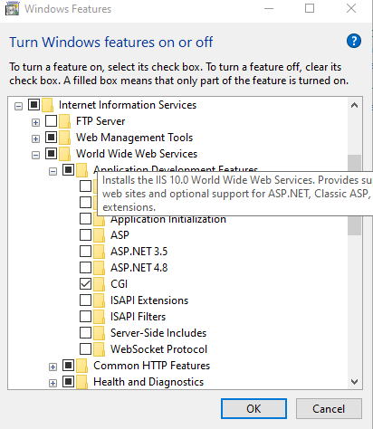
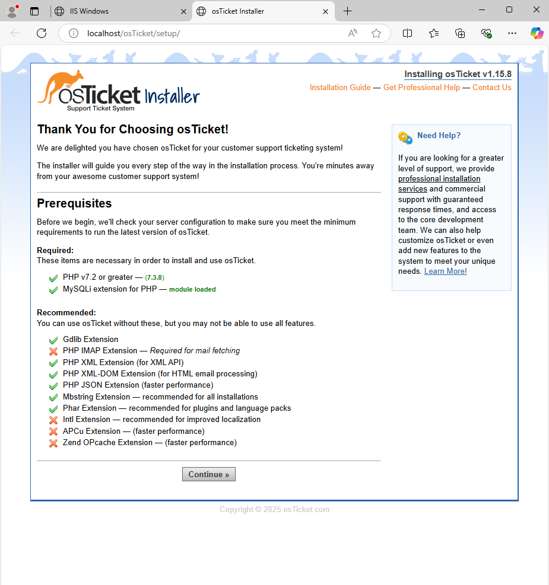
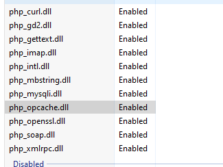
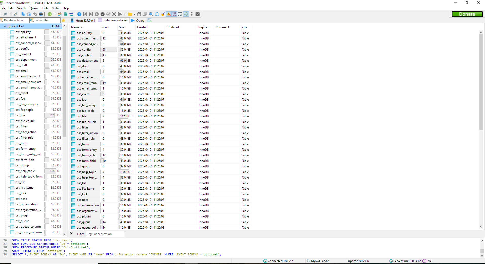
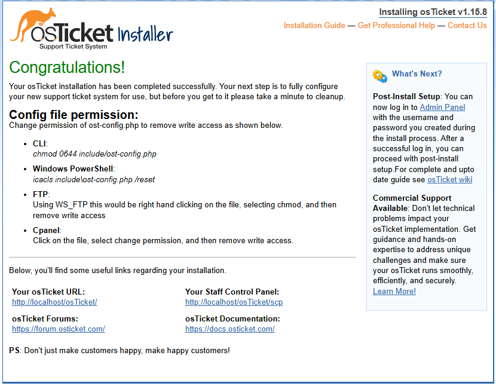
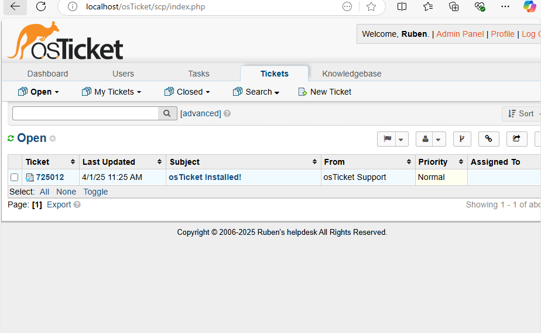

<h1>osTicket - Prerequisites and Installation</h1>
This tutorial outlines the prerequisites and installation of the open-source help desk ticketing system osTicket. 

# 🧰 osTicket Installation on Azure VM

This project walks through the installation of osTicket v1.15.8 on a Windows 10 Azure Virtual Machine.

---

## 💻 VM Setup

1. **Create Azure VM**
   - **OS:** Windows 10
   - **vCPUs:** 4
   - **VM Name:** `osticket-vm`
   - **Username:** `labuser`
   - **Password:** `osTicketPassword1!`

2. **Remote Desktop into the VM**

---

## 📁 File Setup

1. Download `osTicket-Installation-Files.zip` onto the VM desktop and unzip it.
2. The extracted folder should be called `osTicket-Installation-Files`.

---

## 🌐 IIS & PHP Configuration

1. **Enable IIS with CGI:**
   - Go to *Windows Features* > `World Wide Web Services` > `Application Development Features`
   - Check `[X] CGI`

2. **Install the following (from the extracted folder):**
   - PHP Manager for IIS (`PHPManagerForIIS_V1.5.0.msi`)
   - IIS Rewrite Module (`rewrite_amd64_en-US.msi`)

3. **Setup PHP:**
   - Create folder `C:\PHP`
   - Unzip `php-7.3.8-nts-Win32-VC15-x86.zip` into `C:\PHP`
   - Install `VC_redist.x86.exe`

4. **Install MySQL:**
   - Use `mysql-5.5.62-win32.msi`
   - Setup: Typical
   - Username: `root`
   - Password: `root`

---

## 🛠️ Configuring IIS for PHP

1. Open **IIS as Admin**
2. Register PHP in PHP Manager:
   - Path: `C:\PHP\php-cgi.exe`
3. Reload IIS (Stop and Start server)

---

## 🧷 Install osTicket

1. Unzip `osTicket-v1.15.8.zip`
2. Copy the `upload` folder into: `C:\inetpub\wwwroot`
3. Rename `upload` to `osTicket`

4. Reload IIS and navigate:
   - Sites → Default → `osTicket`
   - Click: **Browse *:80**

---

## 🔌 Enable PHP Extensions

1. IIS → Sites → Default → `osTicket` → PHP Manager
2. Enable:
   - `php_imap.dll`
   - `php_intl.dll`
   - `php_opcache.dll`
3. Refresh the browser

---

## 🔐 Configure osTicket

1. **Rename Config File:**
   - From: `ost-sampleconfig.php`
   - To: `ost-config.php`

2. **Set Permissions:**
   - Disable inheritance
   - Remove all
   - Add `Everyone` → Full Control

3. In browser:
   - Set Helpdesk Name
   - Set Default Email

---

## 🧮 Setup Database

1. Install `HeidiSQL`
2. Create a new session:
   - User: `root`
   - Pass: `root`
3. Create Database: `osTicket`

4. In browser:
   - MySQL Database: `osTicket`
   - MySQL User: `root`
   - MySQL Password: `root`
   - Click: **Install Now**

---

## 🥳 Done!

- Admin Login: `http://localhost/osTicket/scp/login.php`
- User URL: `http://localhost/osTicket/`

## 📸 Screenshots

 
